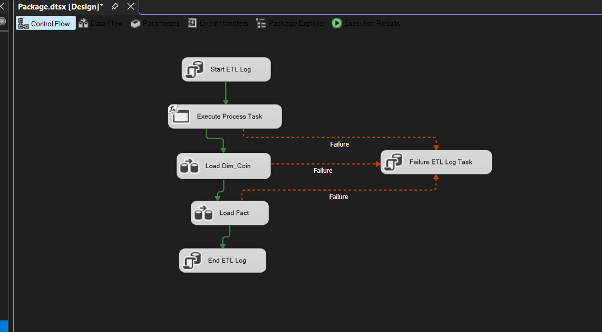
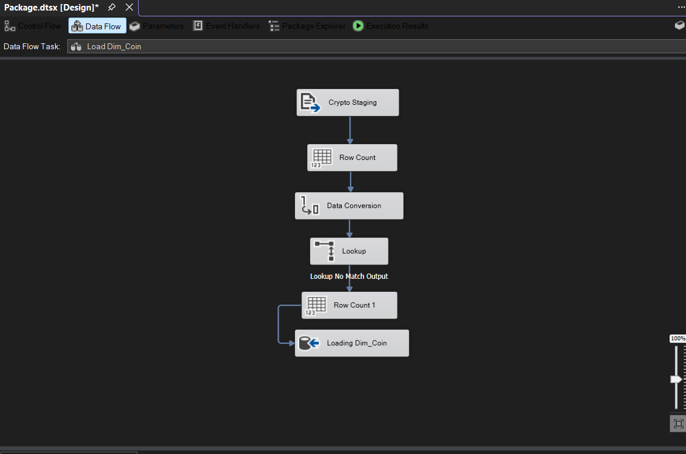
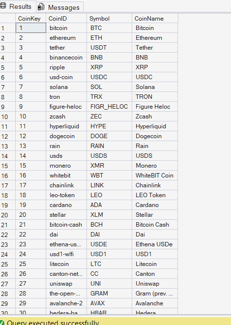
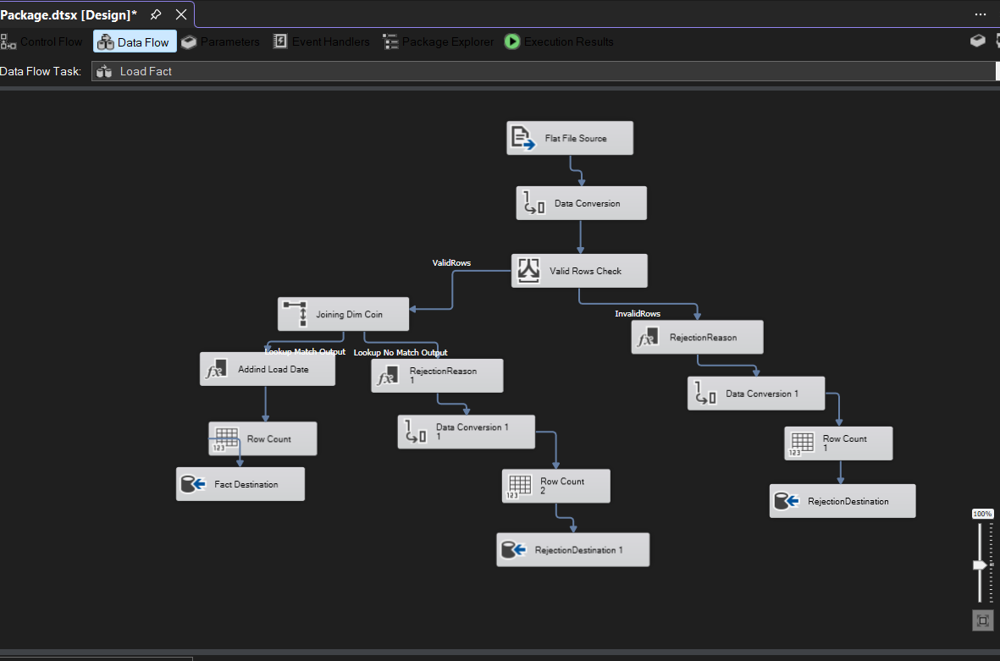
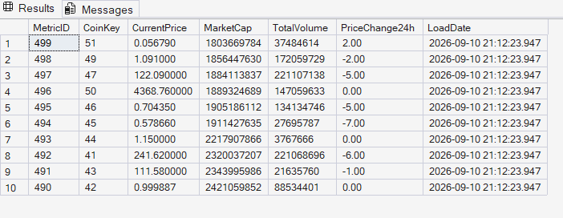
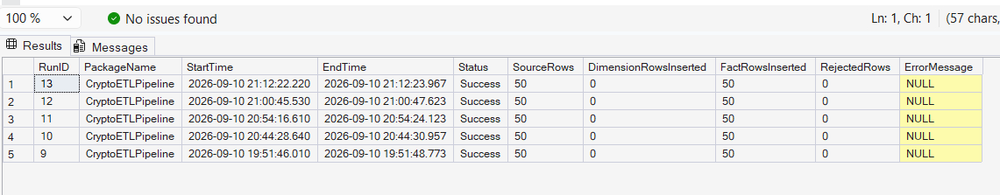
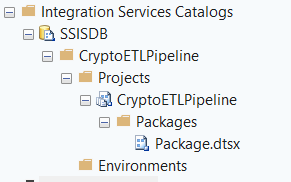

# Automated Crypto & Market Data Intelligence Pipeline

An automated ETL and data warehousing pipeline that extracts cryptocurrency market data from the **CoinGecko API**, processes and validates it using **Python** and **SQL Server Integration Services (SSIS)**, and loads it into a structured **SQL Server** data warehouse.

---

## 📌 Project Overview

Cryptocurrency market data changes continuously, making manual collection, processing, and storage inefficient. 

This project automates the complete data pipeline, from API extraction to SQL Server storage and daily scheduled execution.

The pipeline extracts the **top 50 cryptocurrency market records**, stages the data in CSV format, performs data validation and transformations using SSIS, loads cryptocurrency information into a dimension table and market metrics into a fact table, maintains ETL execution logs and rejected records, and runs automatically through **Windows Task Scheduler**.

---

## 🎯 Project Objective

The main objective of this project is to build a reliable and automated ETL pipeline for cryptocurrency market data.

The pipeline is designed to:
* Extract cryptocurrency market data from the **CoinGecko API**
* Process and stage the extracted data using **Python and Pandas**
* Validate incoming records before loading
* Perform data type conversions using **SSIS**
* Load cryptocurrency information incrementally into a dimension table
* Retrieve surrogate keys using **SSIS Lookup transformations**
* Load market metrics into a fact table
* Handle invalid and unmatched records
* Maintain **ETL execution logs**
* Capture and record ETL errors
* Deploy the SSIS package to **SSISDB**
* Execute the deployed package using **DTExec**
* Automate daily execution using **Windows Task Scheduler**

---

## 🏗️ Architecture

```text
                    CoinGecko API
                          |
                          v
                   Python + Pandas
                          |
                          v
                 CSV Staging Layer
                          |
                          v
                       SSIS ETL
                          |
             +------------+------------+
             |                         |
             v                         v
         Dim_Coin             Fact_MarketMetrics
             |                         |
             +-------- CoinKey --------+
                          |
                          v
                       CryptoDW
                          |
             +------------+------------+
             |                         |
             v                         v
        ETL_RunLog             ETL_RejectedRows
                          |
                          v
                       SSISDB
                          |
                          v
                       DTExec
                          |
               Windows Task Scheduler
                          |
                          v
                   Daily Automation

```

---

## 🛠️ Technologies Used

* **Languages & Libraries:** Python, Pandas, Requests
* **APIs:** CoinGecko REST API
* **Database & Warehousing:** Microsoft SQL Server, SQL Server Management Studio (SSMS)
* **ETL & Orchestration:** SQL Server Integration Services (SSIS), SSISDB, DTExec
* **Automation:** Windows Task Scheduler
* **Development & Version Control:** Visual Studio, GitHub

---

## 📥 Data Extraction

Python is used to retrieve cryptocurrency market data from the CoinGecko API.

The extraction process:

1. Sends an API request for cryptocurrency market data.
2. Retrieves the **top 50 cryptocurrency records**.
3. Parses the JSON response.
4. Selects the required market fields.
5. Converts values into appropriate data types.
6. Adds an extraction timestamp.
7. Stores the processed data in a **CSV staging file**.

### Extracted Fields

* `Coin ID`
* `Symbol`
* `Coin Name`
* `Current Price`
* `Market Cap`
* `Total Volume`
* `24-hour Price Change`
* `Extraction Timestamp`

---

## 🔄 SSIS ETL Workflow

The SSIS package contains the following control flow:

```text
Start ETL Log
      |
      v
Execute Python Extraction
      |
      v
Load Dim_Coin
      |
      v
Load Fact_MarketMetrics
      |
      v
End ETL Log

```

*Note: Failure paths are connected to a dedicated failure logging task so that ETL errors can be recorded.*

---

## 🗂️ Dimension Loading

The `Dim_Coin` table stores cryptocurrency master information.

The dimension data flow performs the following operations:

```text
CSV Source
    |
    v
Row Count
    |
    v
Data Conversion
    |
    v
Lookup Dim_Coin
    |
    +---- Existing Coin ----> No Insert
    |
    +---- New Coin ---------> Insert

```

An SSIS **Lookup transformation** checks whether a cryptocurrency already exists in the dimension table. Only new cryptocurrency records are inserted, providing **incremental dimension loading** and preventing duplicate dimension records.

### `Dim_Coin` Schema

| Column | Description |
| --- | --- |
| `CoinKey` | Surrogate key generated by SQL Server |
| `CoinID` | Unique cryptocurrency identifier |
| `Symbol` | Cryptocurrency symbol |
| `CoinName` | Cryptocurrency name |

---

## 📈 Fact Loading

The `Fact_MarketMetrics` table stores market measurements for each cryptocurrency.

The fact data flow performs:

* Data type conversion
* Data validation
* Dimension lookup
* Surrogate key retrieval
* Load date generation
* Fact table insertion
* Rejected-row handling

The `CoinKey` retrieved from `Dim_Coin` is used to maintain the relationship between the dimension and fact tables.

### `Fact_MarketMetrics` Schema

| Column | Description |
| --- | --- |
| `MetricID` | Fact record identifier |
| `CoinKey` | Foreign key referencing `Dim_Coin` |
| `CurrentPrice` | Current cryptocurrency price |
| `MarketCap` | Market capitalization |
| `TotalVolume` | Trading volume |
| `PriceChange24h` | 24-hour price change |
| `LoadDate` | ETL load timestamp |

---

## ✅ Data Validation

Incoming fact records are validated before being loaded into the fact table.

The implemented validation rules are:

* **CurrentPrice** > 0
* **MarketCap** >= 0
* **TotalVolume** >= 0

Records that fail validation are redirected to the rejection flow instead of being loaded into `Fact_MarketMetrics`.

---

## 🚫 Rejected-Row Handling

Rejected records are stored in: `ETL_RejectedRows`

The rejection flow captures the original record and the reason for rejection. Possible rejection reasons include:

* Invalid current price
* Invalid market cap
* Invalid total volume
* Coin not found in dimension

This provides full traceability for data quality issues and lookup failures.

---

## 📋 ETL Logging

The pipeline maintains an execution log in: `ETL_RunLog`

The logging table records:

* Run ID
* Package name
* Start and End time
* Execution status
* Source row count
* Dimension rows inserted
* Fact rows inserted
* Rejected rows
* Error message

The SSIS **OnError event handler** captures the actual error description and stores it in the ETL log, allowing both successful and failed executions to be tracked.

---

## ⚙️ Package Parameterization

The SSIS package uses package parameters for important environment-specific paths:

* `PythonExePath`
* `PythonScriptPath`
* `StagingFilePath`
* `WorkingDirectory`

Parameterization reduces hard-coded configuration values inside the SSIS package and makes maintenance easier.

---

## 🚀 SSISDB Deployment

The SSIS project was deployed to the SQL Server Integration Services Catalog.

The deployed project structure is:

```text
SSISDB
└── CryptoETLPipeline
    └── Projects
        └── CryptoETLPipeline
            └── Packages
                └── Package.dtsx

```

The deployed package was successfully executed using **DTExec**.

---

## ⏰ Automation

The deployed SSIS package is executed using **DTExec** and scheduled through **Windows Task Scheduler**.

```text
Windows Task Scheduler --> DTExec --> SSISDB Package --> Python Extraction & SSIS ETL --> CryptoDW

```

The task is configured to execute the ETL pipeline **daily**, and the scheduled task was manually tested successfully.

---

## 📊 Pipeline Results

A successful pipeline execution processes:

* **Source Rows:** 50
* **Fact Rows Inserted:** 50
* **Rejected Rows:** 0
* **Status:** Success

---

## 🗄️ Database Design

The project uses a simple **star-schema-style** design.

```text
                 Dim_Coin
                    |
                    |
                 CoinKey
                    |
                    v
           Fact_MarketMetrics

```

* **Dimension Table:** `Dim_Coin` (`CoinKey`, `CoinID`, `Symbol`, `CoinName`)
* **Fact Table:** `Fact_MarketMetrics` (`MetricID`, `CoinKey`, `CurrentPrice`, `MarketCap`, `TotalVolume`, `PriceChange24h`, `LoadDate`)
* **Supporting ETL Tables:** `ETL_RunLog`, `ETL_RejectedRows`

---

## 📷 Screenshots

### 1. SSIS Control Flow

The control flow shows overall ETL orchestration including Python extraction, dimension/fact loading, and success/failure logging.




### 2. Dimension Data Flow

Demonstrates staging, row counting, data conversion, lookup processing, and incremental insertion.




### 3. Dimension Data

Example records loaded into the `Dim_Coin` table.




### 4. Fact Data Flow

Demonstrates data conversion, validation, dimension lookup, load date creation, fact loading, and rejection handling.




### 5. Fact Table Results

Example market metric records successfully loaded into `Fact_MarketMetrics`.




### 6. ETL Run Log

Execution log demonstrating successful runs with source rows, fact rows, rejected rows, execution status, and error tracking.




### 7. SSISDB Deployment

The deployed `CryptoETLPipeline` project and `Package.dtsx` package inside the SSISDB Integration Services Catalog.




### 8. Windows Task Scheduler

Configured daily automated execution of the Crypto ETL pipeline.


---

## ✨ Key Features

* REST API-based cryptocurrency data extraction
* Python and Pandas data processing
* CSV staging layer
* SSIS-based ETL pipeline
* Data type conversion & validation
* Incremental dimension loading & lookup-based surrogate key handling
* Fact table loading & rejected-row handling
* ETL execution logging & error message capture
* SSIS package parameterization
* SSISDB deployment & DTExec execution
* Daily Windows Task Scheduler automation

---

## 🎯 Project Outcome

The completed solution demonstrates an end-to-end automated data engineering workflow, successfully extracting, staging, validating, transforming, loading, logging, and scheduling cryptocurrency data directly into SQL Server.

---

## 🔮 Future Improvements

* Build a **Power BI dashboard** for cryptocurrency market analysis
* Store and analyze historical market data
* Add additional cryptocurrency metrics and advanced data quality rules
* Implement automated monitoring and alerting
* Add additional market data sources and trend/performance analysis

---

## 👤 Author

**James Waghmare**

Computer Engineering Student | SQL & Data Engineering Enthusiast

